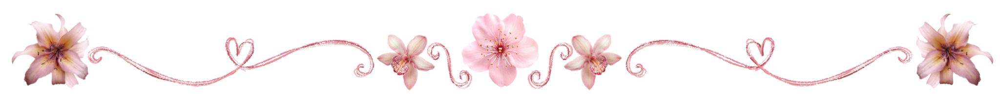

<h1 align="center">Catalina Andrea Galleguillos Carvajal</h1>

  

## ˚₊‧꒰ა About me ໒꒱ ‧₊˚

- I'm from Chile, passionate about learning new technologies and expanding my knowledge every day.
- I'm 21 years old
- I'm a third-year Civil Engineering student specializing in Computing and Informatics.
- I value collaboration, adaptability, and continuous learning, and I am always eager to take on challenges that help me grow both academically and personally. My goal is to combine my technical skills with a strong work ethic to create solutions that make a positive impact.
- I enjoy watching films, anime, painting, music, and gym.

  

 
## ✶⋆.˚ Tech Stack:

               

<h3 align="center">📊 GitHub Stats</h3>

  
  

<h3 align="center">Connect with me:</h3>

  

